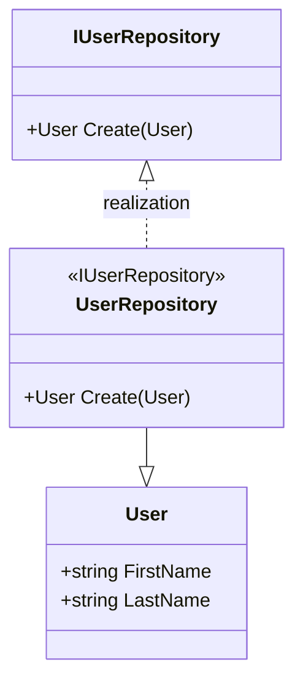
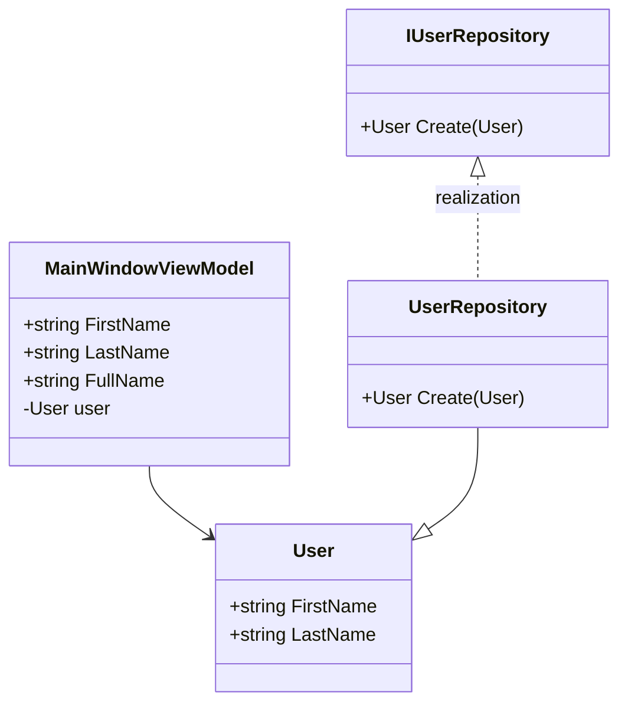

# A. MVVM with .NET

.NET標準クラスライブラリのみで作成

- [A. MVVM with .NET](#a-mvvm-with-net)
  - [INotifyPropertyChangedによるデータバインディング](#inotifypropertychangedによるデータバインディング)
    - [Modelの実装](#modelの実装)
    - [ViewModelクラスの作成](#viewmodelクラスの作成)

## INotifyPropertyChangedによるデータバインディング

### Modelの実装

### ViewModelクラスの作成

ウィンドウ名+`ViewModel`クラスを作成する  

