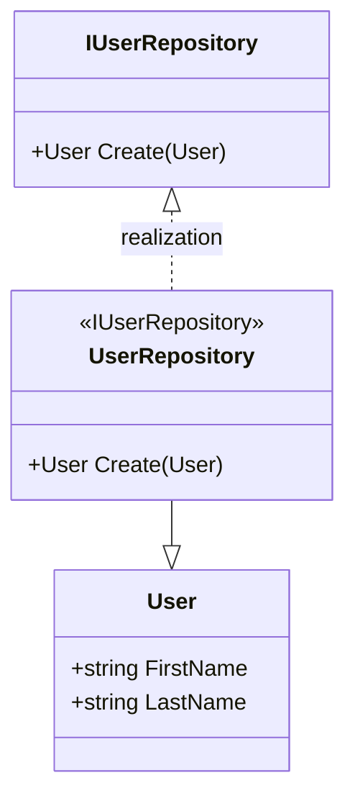
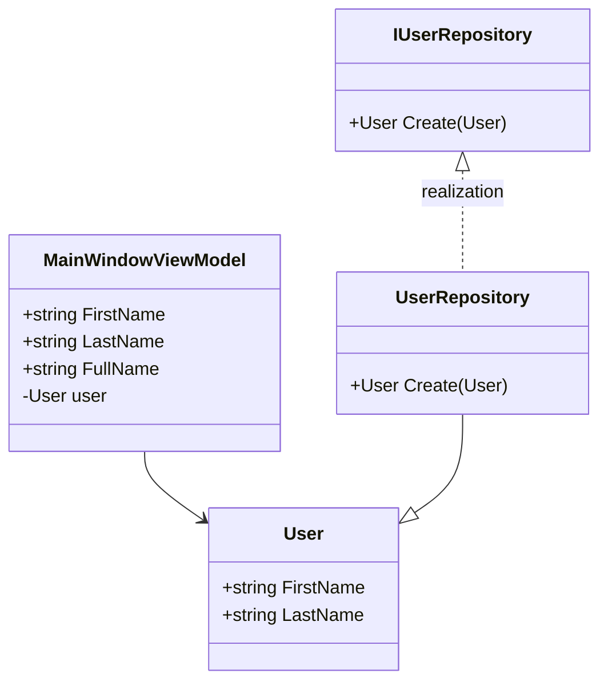
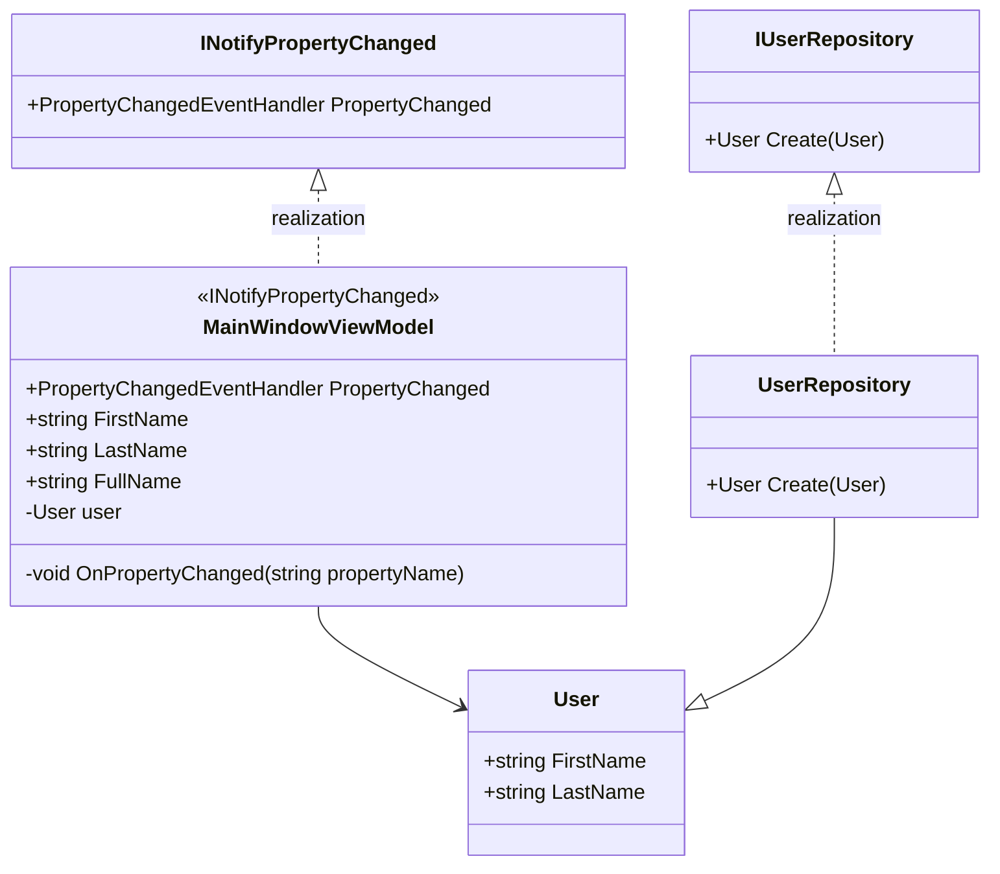
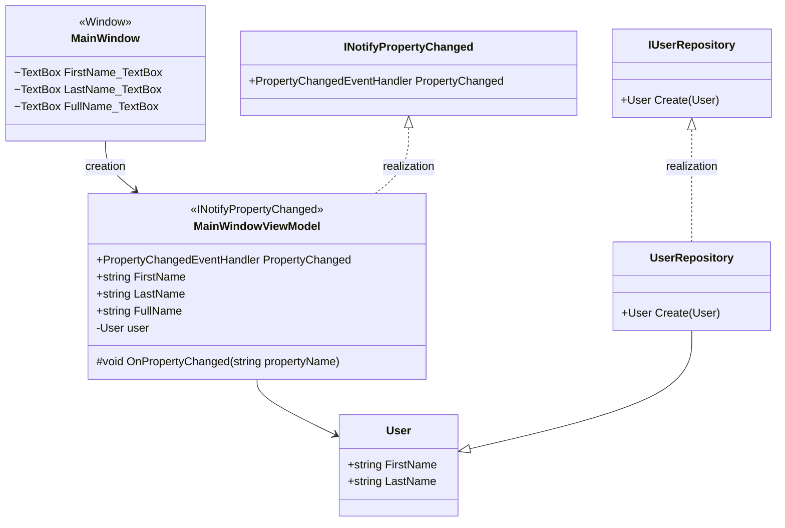
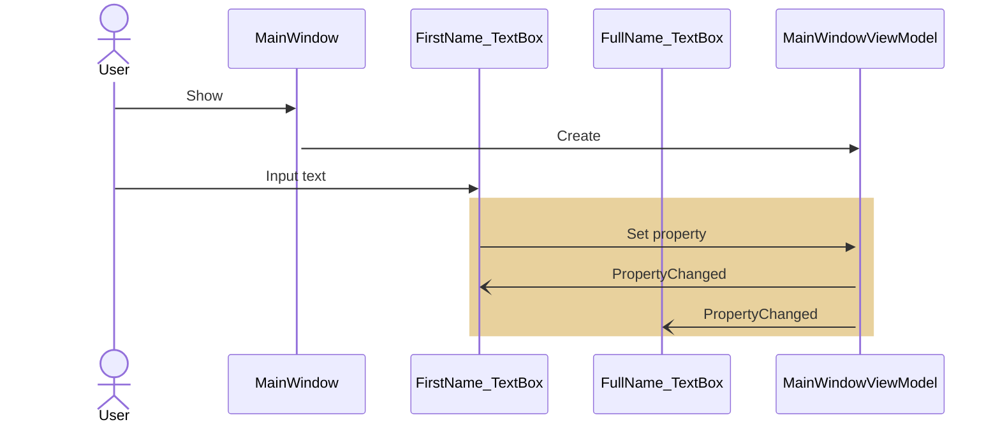
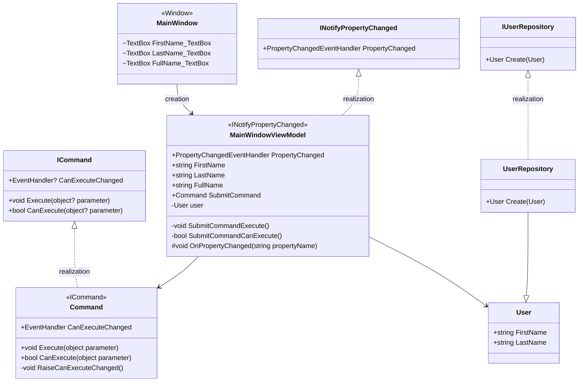
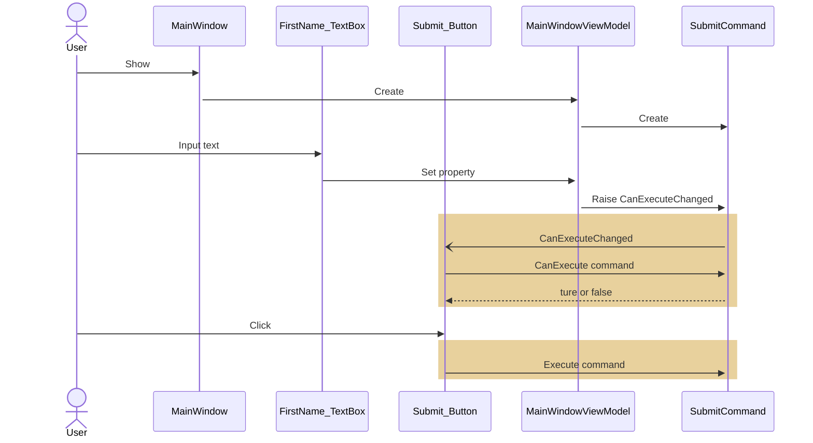

# A. MVVM with .NET

.NET標準クラスライブラリのみで作成

- [A. MVVM with .NET](#a-mvvm-with-net)
  - [INotifyPropertyChangedによるデータバインディング](#inotifypropertychangedによるデータバインディング)
    - [Modelの実装](#modelの実装)
    - [ViewModelクラスの作成](#viewmodelクラスの作成)
    - [INotifyPropertyChangedの実装](#inotifypropertychangedの実装)
    - [View-ViewModelのデータバインディング](#view-viewmodelのデータバインディング)
    - [ICommandの実装](#icommandの実装)

## INotifyPropertyChangedによるデータバインディング

### Modelの実装



### ViewModelクラスの作成

ウィンドウ名+`ViewModel`クラスを作成する  



### INotifyPropertyChangedの実装

ViewModelクラスにINotifyPropertyChangedを実装する  

- ViewModel:`MainWindowViewModel`  



```csharp
internal class MainWindowViewModel : INotifyPropertyChanged
{
    // INotifyPropertyChanged の実装
    public event PropertyChangedEventHandler PropertyChanged;

    private void OnPropertyChanged([CallerMemberName] string propertyName = null)
    {
        PropertyChanged?.Invoke(this, new PropertyChangedEventArgs(propertyName));
    }
}
```

```csharp
internal class MainWindowViewModel : INotifyPropertyChanged
{
    private string firstName;

    public string FirstName
    {
        get { return firstName; }
        set
        {
            firstName = value;
            OnPropertyChanged(); // 自プロパティの変更イベントを送信
            OnPropertyChanged(nameof(FullName)); // 関連プロパティの変更イベントを送信
        }
    }
}
```

### View-ViewModelのデータバインディング

ViewとViewModelをバインドする  

- View：`MainWindow`  
- ViewModel:`MainWindowViewModel`





```xaml
<Window.DataContext>
    <local:MainWindowViewModel />
</Window.DataContext>
```

```xaml
<TextBox x:Name="FirstName_TextBox"
         Text="{Binding FirstName, Mode=TwoWay, UpdateSourceTrigger=PropertyChanged}" />
<TextBlock x:Name="FullName_TextBox"
           Text="{Binding FullName}" />
```

### ICommandの実装

- View：`MainWindow`  
- ViewModel:`MainWindowViewModel`
- 




