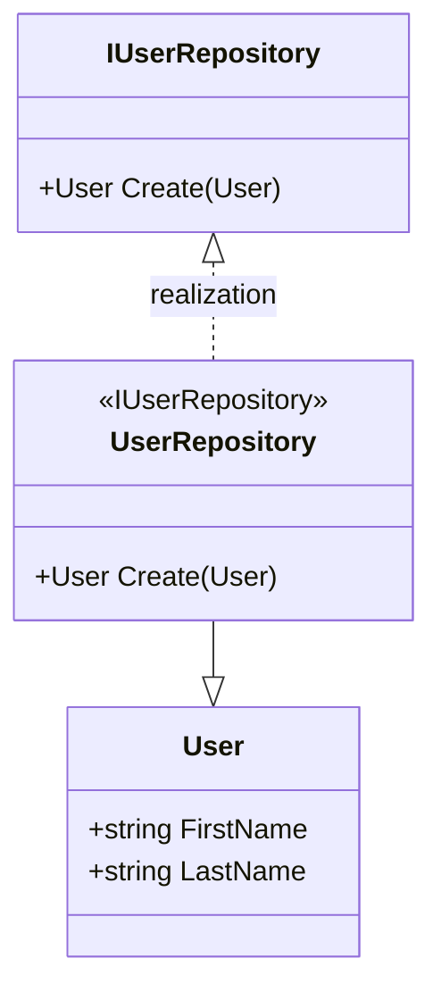

# B. MVVM with Prism

Prismライブラリで作成

- [A. MVVM with .NET](#a-mvvm-with-net)
  - [INotifyPropertyChangedによるデータバインディング](#inotifypropertychangedによるデータバインディング)
    - [Modelの実装](#modelの実装)

## INotifyPropertyChangedによるデータバインディング

### Modelの実装

